<div align="center">



<br/>

<a href="https://www.linkedin.com/in/akshay-damle-858263252/">
  
</a>

</div>

<br/>

> Building at the edge of AI and adversarial systems — where intelligent automation becomes a threat, and detection becomes a craft.

<br/>

```text
STATUS      hunting bots · studying adversarial AI
BUILDING    detection tools, threat models, and sharper intuition
EXPLORING   behavioral fingerprinting · network forensics · prompt injection
ASKING      how do you catch something designed to look human?
```

<br/>

---

### Stack


---

### Focus

<table>
<tr>
<td valign="top" width="50%">

**Bot Detection & Hunting**

Fingerprinting automated behavior, spotting coordinated inauthentic activity, and building systems that catch what looks almost — but not quite — human.

</td>
<td valign="top" width="50%">

**AI Security**

Where models fail under adversarial pressure. Prompt injection, model manipulation, and the gap between what a system does and what we assume it does.

</td>
</tr>
<tr>
<td valign="top" width="50%">

**Behavioral Analysis**

Reading traffic patterns and interaction signals to separate organic behavior from scripted noise. The anomaly is always in the timing.

</td>
<td valign="top" width="50%">

**Research Mindset**

Ask the question that doesn't have an answer yet. Build something that forces the answer out. Document what breaks along the way.

</td>
</tr>
</table>

---

### Projects

<!-- Replace REPO_NAME_1 / REPO_NAME_2 with your actual repo names -->

<div align="center">

[](https://github.com/codezxsWIN/REPO_NAME_1)
&nbsp;
[](https://github.com/codezxsWIN/REPO_NAME_2)

</div>

---

<div align="center">
<sub>Curiosity is the beginning. Consistency is the multiplier.</sub>
</div>
