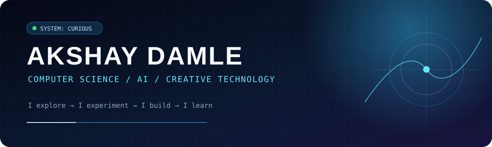
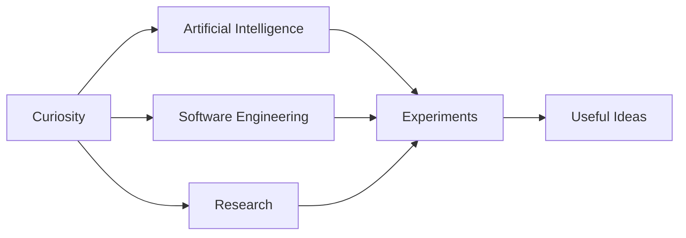

<div align="center">



<br />

### BUILDING A MINDSET, NOT JUST A STACK.

I am a computer science student drawn to intelligent systems, creative technology, and ideas that challenge how things are usually done.

<br />

[](https://www.linkedin.com/in/akshay-damle-858263252/) [](https://github.com/codezxsWIN)

</div>

---

### 〔 CURRENT SIGNAL 〕

```text
STATUS      learning in public
DIRECTION   computer science × AI × meaningful innovation
METHOD      question → prototype → observe → improve
LOOKING FOR problems worth thinking deeply about
```

### 〔 CURIOSITY MAP 〕



### 〔 WHAT DRIVES ME 〕

> I am interested in technology not only as a tool, but as a way to understand systems, test ideas, and create possibilities.

- Finding patterns inside complex problems
- Learning by turning questions into experiments
- Connecting technical thinking with real-world impact
- Building the depth required for future research

### 〔 WORKING LANGUAGE 〕


### 〔 NOW LOADING 〕

```text
Computer science foundations  ███████████████░░░  evolving
AI and emerging technology    ████████████░░░░░░  exploring
Research mindset              ██████████░░░░░░░░  developing
Better questions              █████████████████░  always
```

---

<div align="center">

<sub>Curiosity is the beginning. Consistency is the multiplier.</sub>
<br /><br />


</div>
