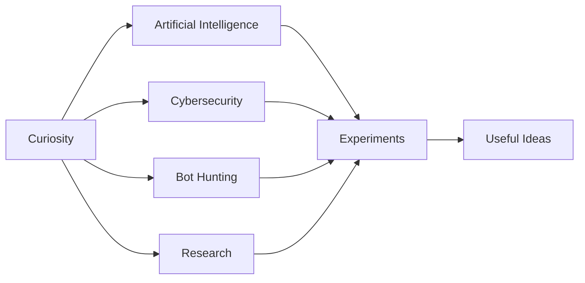

<div align="center">


<br />

### BUILDING A MINDSET, NOT JUST A STACK.

I am a cybersecurity and AI enthusiast exploring intelligent systems, adversarial behavior, and the questions that emerge when software can act on our behalf.

<br />

[](https://www.linkedin.com/in/akshay-damle-858263252/) [](https://github.com/codezxsWIN)

</div>

---

### 〔 CURRENT SIGNAL 〕

```text
STATUS      learning in public
DIRECTION   cybersecurity × AI × agent trust
METHOD      question → prototype → observe → improve
LOOKING FOR problems worth thinking deeply about
```

### 〔 CURIOSITY MAP 〕



### 〔 RESEARCH VECTOR 〕

> I study how identity, intent, authorization, and agent capability shape trust online.

- **AI agent containment:** tool permissions, prompt injection, escape paths, and safeguards.
- **Bot detection & hunting:** synthetic activity, behavioral signals, and authorized automation.
- **Manipulation & digital identity:** who is behind an action and whether authority can be verified.
- **Defensive engineering:** repeatable tests, evidence, and accountable outcomes.

### 〔 CURRENT RESEARCH 〕

I am working on a research paper about how AI agents can act beyond their intended containment boundaries. Status: **research in progress**.

### 〔 SELECTED WORK 〕

- [**mcp_redteam**](https://github.com/codezxsWIN/mcp_redteam) — runtime probes for MCP tool poisoning, output injection, rug pulls, and resource boundary risks.
- [**Aura**](https://github.com/codezxsWIN/Aura-Autonomous-Incident-Response) — bounded autonomous incident response with independent verification and evidence receipts.
- [**Cybersecurity Knowledge Base**](https://github.com/codezxsWIN/1-DAILY-TRYHACKME-ROOM-CHALLENGE) — structured notes and hands-on security learning.

### 〔 WORKING LANGUAGE 〕

   

### 〔 NOW LOADING 〕

```text
Computer science foundations  ███████████████░░░  evolving
AI security and agents        █████████████░░░░░  exploring
Bot hunting and identity      ██████████░░░░░░░░  researching
Better questions              █████████████████░  always
```

---

<div align="center">
<sub>Curiosity is the beginning. Consistency is the multiplier.</sub>
<br /><br />

</div>
