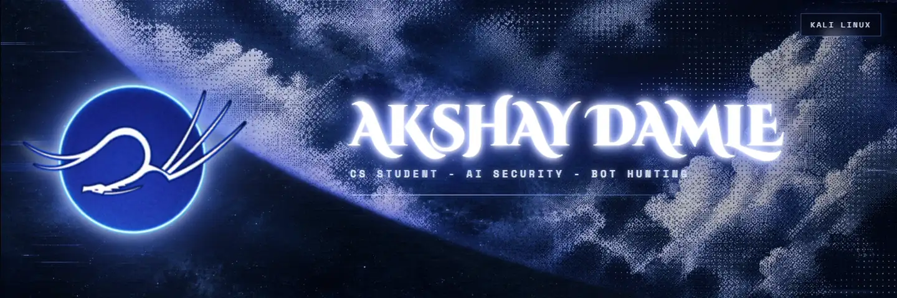

  

 

<h2 align="center">Hunting the automation hiding in plain sight.</h2>

  <code>BOT DETECTION</code> &nbsp; <code>THREAT HUNTING</code> &nbsp; <code>ADVERSARIAL AI</code>

  I track behavioral signals, study evasive bots, and test where AI agents break trust boundaries.

## What I hunt

- **Evasive automation:** bots borrowing browser fingerprints, changing request patterns, and blending into ordinary traffic.
- **Coordinated identities:** timing, repeated behavior, and interaction patterns that connect suspicious accounts.
- **Agent trust failures:** prompt injection, tool poisoning, and boundary crossing in autonomous workflows.

Observe the behavior. Form a hypothesis. Test it against the evidence.

## In the lab

<table>
<tr>
<td width="50%" valign="top">
  01 / EVASIVE AUTOMATION
  <h3>CrawlerLab</h3>
  
A bot hunting lab for behavioral detection, crawler fingerprinting, and bounded deception.

  
<code>Bot detection</code> <code>Deception</code>

  
<kbd>COMING SOON</kbd> Private development · Public release in preparation

</td>
<td width="50%" valign="top">
  02 / ACCESS &amp; TRUST
  <h3>Blast Radius</h3>
  
A graph lab for mapping credential reach, tracing trust boundaries, and exploring how a compromise could spread.

  
<code>Attack paths</code> <code>Graph analysis</code>

  
<kbd>COMING SOON</kbd> Private development · Public release in preparation

</td>
</tr>
</table>

## Public field tools

- **[MCP Redteam](https://github.com/codezxsWIN/mcp_redteam)** — Runtime probes for tool poisoning, prompt injection, and changes to MCP tool definitions, with transcripts and reproduction steps.
- **[Aura](https://github.com/codezxsWIN/Aura-Autonomous-Incident-Response)** — A local incident-response prototype with bounded actions, independent recovery checks, and tamper-evident evidence.

## Detection toolkit

  
  
  
  

  <code>Traffic analysis</code> <code>Behavioral fingerprints</code> <code>Threat modeling</code> <code>Network forensics</code>

---

  <strong>Follow the signal.</strong> 
  <a href="https://www.linkedin.com/in/akshay-damle-858263252/">Talk bots, detections, or adversarial AI ↗</a>

